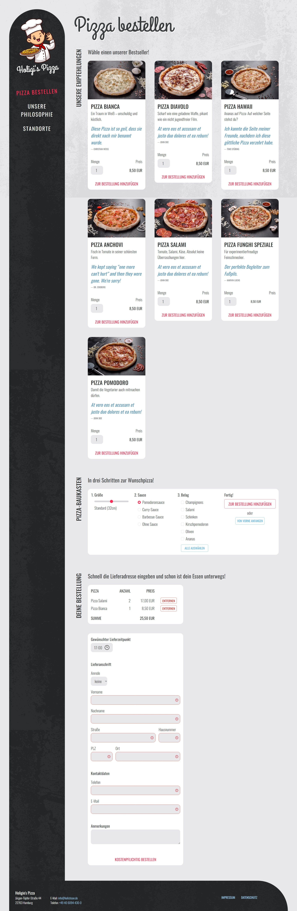

# Holigi's Pizza

## Aufgabe 1
Optisch ist die Seite in Ordnung, aber der HTML-Code ist leider unter akuter [Divitis](https://en.wiktionary.org/wiki/divitis). Das geht besser! 

**Ersetze alle `div`s und `span`s in der `index.html` durch die semantischen HTML-Elemente in der unten stehenden Tabelle.**

⚠️ Aufpassen!

An zwei Stellen im Dokument kommt ihr um ein `div` nicht herum.

| HTML tag     | MDN link                                                       |
| :----------- | :------------------------------------------------------------- |
| `abbr`       | https://developer.mozilla.org/docs/Web/HTML/Element/abbr       |
| `address`    | https://developer.mozilla.org/docs/Web/HTML/Element/address    |
| `article`    | https://developer.mozilla.org/docs/Web/HTML/Element/article    |
| `blockquote` | https://developer.mozilla.org/docs/Web/HTML/Element/blockquote |
| `button`     | https://developer.mozilla.org/docs/Web/HTML/Element/button     |
| `div`        | https://developer.mozilla.org/docs/Web/HTML/Element/div        |
| `fieldset`   | https://developer.mozilla.org/docs/Web/HTML/Element/fieldset   |
| `figcaption` | https://developer.mozilla.org/docs/Web/HTML/Element/figcaption |
| `figure`     | https://developer.mozilla.org/docs/Web/HTML/Element/figure     |
| `footer`     | https://developer.mozilla.org/docs/Web/HTML/Element/footer     |
| `form`       | https://developer.mozilla.org/docs/Web/HTML/Element/form       |
| `h1`         | https://developer.mozilla.org/docs/Web/HTML/Element/h1         |
| `h2`         | https://developer.mozilla.org/docs/Web/HTML/Element/h2         |
| `h3`         | https://developer.mozilla.org/docs/Web/HTML/Element/h3         |
| `header`     | https://developer.mozilla.org/docs/Web/HTML/Element/header     |
| `img`        | https://developer.mozilla.org/docs/Web/HTML/Element/img        |
| `input`      | https://developer.mozilla.org/docs/Web/HTML/Element/input      |
| `label`      | https://developer.mozilla.org/docs/Web/HTML/Element/label      |
| `legend`     | https://developer.mozilla.org/docs/Web/HTML/Element/legend     |
| `li`         | https://developer.mozilla.org/docs/Web/HTML/Element/li         |
| `main`       | https://developer.mozilla.org/docs/Web/HTML/Element/main       |
| `nav`        | https://developer.mozilla.org/docs/Web/HTML/Element/nav        |
| `ol`         | https://developer.mozilla.org/docs/Web/HTML/Element/ol         |
| `output`     | https://developer.mozilla.org/docs/Web/HTML/Element/output     |
| `p`          | https://developer.mozilla.org/docs/Web/HTML/Element/p          |
| `script`     | https://developer.mozilla.org/docs/Web/HTML/Element/script     |
| `section`    | https://developer.mozilla.org/docs/Web/HTML/Element/section    |
| `select`     | https://developer.mozilla.org/docs/Web/HTML/Element/select     |
| `strong`     | https://developer.mozilla.org/docs/Web/HTML/Element/strong     |
| `table`      | https://developer.mozilla.org/docs/Web/HTML/Element/table      |
| `tbody`      | https://developer.mozilla.org/docs/Web/HTML/Element/tbody      |
| `td`         | https://developer.mozilla.org/docs/Web/HTML/Element/td         |
| `textarea`   | https://developer.mozilla.org/docs/Web/HTML/Element/textarea   |
| `tfoot`      | https://developer.mozilla.org/docs/Web/HTML/Element/tfoot      |
| `th`         | https://developer.mozilla.org/docs/Web/HTML/Element/th         |
| `thead`      | https://developer.mozilla.org/docs/Web/HTML/Element/thead      |
| `tr`         | https://developer.mozilla.org/docs/Web/HTML/Element/tr         |
| `ul`         | https://developer.mozilla.org/docs/Web/HTML/Element/ul         |

## Aufgabe 2
Für die Validierung von Formularen ist nicht immer JavaScript notwendig. Viele Eingabe lassen sich auch über entsprechende HTML-Attribute an den `input`-Elemente validieren. Setze die richtigen Input-Types und weitere Attribute, um die Formulare mit sinnvollen Validierungen zu ergänzen.

Auf MDN findest du valide [Input-Types](https://developer.mozilla.org/en-US/docs/Web/HTML/Element/input#input_types) und [alle erlaubten Attribute](https://developer.mozilla.org/en-US/docs/Web/Guide/HTML/Constraint_validation) für die Eingabevalidierung.

- Das Eingabefeld für die Menge von einer Pizza sollte nur positive Ganzzahlen akzeptieren.
- Das Eingabefeld für die Menge öffnet auf Touch-Geräten eine Ziffern-Tastatur.
- Der Schieberegler für die Pizza-Größe sollte nur die erlaubten Pizzagrößen (26cm, 32cmm, 38cm) erlauben.
- Alle Felder im Bestellformular sind Pflichtfelder.
- Das Eingabefeld für die Hausnummer soll nur Zahlen gefolgt von Bustaben zulassen.
- Das Eingabefeld für die Postleitzahl soll nur eine Folge von 5 Ziffern akzeptieren.
- Das Eingabefeld für die Postleitzahl öffnet auf Touch-Geräten eine Ziffern-Tastatur.
- Das Eingabefeld für den Ort soll unsere Standorte vorschlagen (Hamburg, Hannover, Kiel).
- Das Eingabefeld für die E-Mail-Adresse akzeptiert nur valide E-Mail-Adressen.
- Das Eingabefeld für die E-Mail-Adresse öffnet auf Touch-Geräten eine E-Mail-Tastatur.
- Das Eingabefeld für die Telefonnummer öffnet auf Touch-Geräten eine Ziffern-Tastatur.

## Aufgabe 3
Schnöde `img`-Elemente sind so 90er. Mit Hilfe der `picture`- und `source`-Elemente könnt ihr HD-Bilder der Pizzen auf Geräten mit hoher Pixeldichte anzeigen. Und wer will schon PNGs, wenn er WebP haben kann? Die [MDN-Doku](https://developer.mozilla.org/en-US/docs/Web/HTML/Element/picture?retiredLocale=de#the_srcset_attribute) hilft euch weiter.

| Datei                     | Auflösung |
| ------------------------- | --------- |
| `*pizza--1440.{webp,jpg}` | 4x        |
| `*pizza--720.{webp,jpg}`  | 2x        |
| `*pizza--360.{webp,jpg}`  | 1x        |

## Aufgabe 4
Erkennt eure wahre Bestimmung, ergänzt die Pizza-Bestellseite um ein Backend und gründet eine Pizzafabrik.

## Das Ergebnis

So sollte euer Ergebnis in etwa aussehen:

